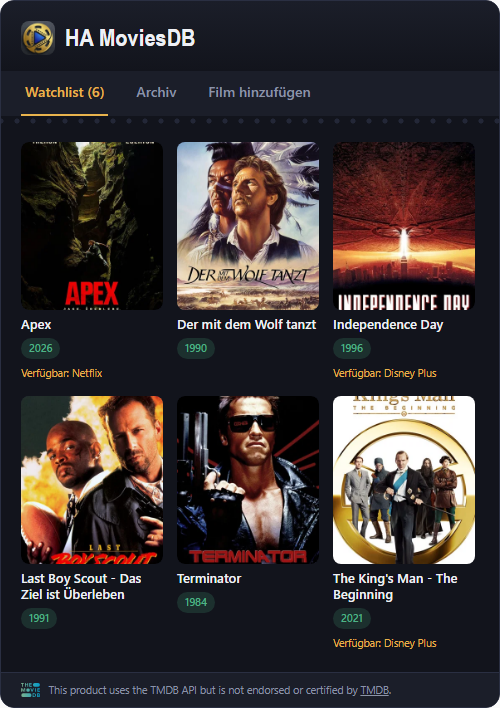

# HA MoviesDB – Home Assistant Custom Integration

<p align="center">
  
</p>

<p align="center">
  <a href="https://github.com/hacs/integration"></a>
  <a href="https://github.com/charly166/ha-moviesdb/releases"></a>
  <a href="https://github.com/charly166/ha-moviesdb/blob/main/LICENSE"></a>
</p>

[Deutsche Version / German version](README.de.md)

---

A Home Assistant custom integration with its own Lovelace card (GUI) for
tracking movies: search for a movie via the free **themoviedb.org (TMDB)
API**, add it to your watchlist, and move it to the archive once you've
watched it. For every movie on your watchlist, the card shows which
streaming service currently offers it (subscription, rent, buy, or free with
ads), based on TMDB's JustWatch-sourced watch-provider data.

This is a sibling project to [HA SeriesDB](https://github.com/charly166/ha-seriesdb),
built on the same architecture, but for movies instead of TV shows.

## Screenshot

<p align="center">
  
</p>

## Features

- Search themoviedb.org and add movies to your watchlist
- "Watchlist" and "Archive" tabs with a poster grid
- Movie detail view: title, release year, runtime, overview
- **Mark as watched** – moves the movie to the "Archive" tab; can be reversed
  at any time
- **Where to watch**: shows which streaming providers currently offer the
  movie (subscription/flatrate, rent, buy, free with ads), grouped by type,
  with your own configured providers highlighted
- **Configurable region and own streaming providers**: choose your country
  (streaming availability is region-specific) and the services you actually
  subscribe to under Settings → Devices & Services → HA MoviesDB →
  Configure
- Card width **and height** are resizable by dragging in modern "Sections"
  dashboards, filling exactly the assigned grid cell
- Own icon/logo under Settings → Devices & Services (Home Assistant 2026.3+)
- A sensor entity per tracked movie (status + `available_on` list of your own
  providers currently streaming it) for use in automations, e.g. "notify me
  when a movie becomes available on Netflix"
- Services for automations: `add_movie`, `remove_movie`, `set_watched`,
  `set_archived`, `refresh`, `refresh_watch_providers`
- All data (watchlist, watched status, archive) is stored locally in Home
  Assistant (`.storage/ha_moviesdb_data`) – no cloud account needed beyond
  the free TMDB API key

**Out of scope:** linear TV channel broadcast schedules (e.g. "airs Saturday
8:15pm on some channel"). There is no clean, free API for this, so this
integration only covers on-demand streaming availability.

## Legal: TMDB & JustWatch Attribution, License

This integration uses the free TMDB API. Its terms of use require a visible
attribution notice with logo. The card already displays the required text
notice automatically as a small footer – **you only need to add the actual
TMDB logo file once**, since TMDB does not permit automated redistribution
of it:

1. Download one of the approved logos from
   https://www.themoviedb.org/about/logos-attribution (SVG or PNG, e.g. the
   short square variant).
2. Save it unmodified (don't change color/aspect ratio) as `tmdb-logo.svg`
   (or `.png`, in which case adjust the filename once in
   `custom_components/ha_moviesdb/www/ha-moviesdb-card.js`, method
   `_renderTmdbAttribution()`) here:
   ```
   custom_components/ha_moviesdb/www/tmdb-logo.svg
   ```
3. Done – until that file exists, the card simply hides the logo
   placeholder and keeps showing the required text.

Watch-provider (streaming availability) data is sourced from **JustWatch**
and delivered through TMDB's `/watch/providers` API, which has its own,
separate attribution requirement (a visible link back to TMDB/JustWatch,
already included in the movie detail view's "Where to watch" section). This
is not legal advice – please double-check the current wording at
https://developer.themoviedb.org/docs/watch-providers-attribution-requirement
and https://www.themoviedb.org/api-terms-of-use yourself before publishing.

The code itself is licensed under the [MIT License](LICENSE) and may be
freely redistributed, modified, and published. The "HA MoviesDB" logo shown
in the card header is separate artwork provided by the project author.

## Installation

### Via HACS (recommended)

1. In Home Assistant, open **HACS**
2. Click the three-dot menu (top right) → **Custom repositories**
3. Add `https://github.com/charly166/ha-moviesdb` as repository type
   **Integration**
4. Search for **"HA MoviesDB"** in HACS and download it
5. Restart Home Assistant

### Manual

1. Copy the `custom_components/ha_moviesdb` folder into your Home Assistant
   configuration's `custom_components` directory, e.g. via Samba/SSH to:
   ```
   <config>/custom_components/ha_moviesdb/
   ```
2. Restart Home Assistant

## 1. Get a free TMDB API key

1. Create a free account at https://www.themoviedb.org if you don't have one
   yet.
2. Under **Profile → Settings → API** (or directly
   https://www.themoviedb.org/settings/api) request an API key. TMDB will
   ask about the intended use – "Developer" / personal use is fine.
3. Copy the displayed **"API Key (v3 auth)"** (not the "API Read Access
   Token" – that one is not used by this integration).

TMDB's free tier allows generous rate limits for personal use (roughly ~40
requests per 10 seconds), which is more than enough for this integration.

## 2. Set up the integration

**Settings → Devices & Services → Add Integration** → search for "HA
MoviesDB" → enter your API key.

## 3. Configure your region and streaming providers

**Settings → Devices & Services → HA MoviesDB → Configure** lets you choose:

- **Region**: the country used for streaming-availability lookups (defaults
  to Germany). Streaming catalogs differ by country, so pick the region you
  actually watch from.
- **My streaming providers**: which services you're actually subscribed to
  (Netflix, Disney+, Prime Video, ...), picked from TMDB's live, up-to-date
  provider list for your chosen region. These are highlighted in the movie
  detail view and drive the `available_on` sensor attribute.

Changing the region takes full effect the next time you reopen this dialog
(the provider list shown while you're still on the form reflects the region
that was active when you opened it).

## 4. The card registers itself automatically

The card registers itself as a Lovelace dashboard resource on setup – the
same way the manual "Settings → Dashboards → Resources" UI action would, by
writing into the exact same storage collection. No manual step needed for
dashboards in the default storage mode. Just restart Home Assistant once
after installing, then reload your browser.

**Only if your dashboard uses legacy YAML mode** (not the default) does
Home Assistant not allow integrations to write to the resource list at all.
In that case, add this to your `ui-lovelace.yaml` manually:
```yaml
resources:
  - url: /ha_moviesdb/ha-moviesdb-card.js?v=1
    type: module
```
You'll need to bump the `?v=...` number yourself after each future update in
that case – storage-mode dashboards get this automatically. The exact
current version number is always in the startup log (**Settings → System →
Logs**, search for "HA MoviesDB").

## 5. Add the card to your dashboard

1. Edit dashboard → **Add Card** → scroll to the bottom → **Manual**
2. Paste:
   ```yaml
   type: custom:ha-moviesdb-card
   ```
3. Save. The card shows three tabs: "Watchlist", "Archive", and "Add Movie"
   (search).

If your dashboard view uses the **"Sections"** layout (the default for new
dashboards since Home Assistant 2024.5), you can resize both the width and
the height of the card by dragging its edge/corner in the dashboard editor.
Older "Masonry" views don't support per-card sizing (a limitation of that
view type, not of the card).

## 6. Usage

- **Add a movie**: "Add Movie" tab → type a title (search starts
  automatically from 2 characters) → click "Add" on the desired result.
- **Open a movie**: click a poster in "Watchlist" or "Archive" – the detail
  view shows the overview, runtime, and where it's currently available to
  stream (your own configured providers are highlighted with a gold border).
- **Mark as watched**: in the detail view – this also moves the movie to the
  "Archive" tab. Clicking again reverses the watched status (but not the
  archive status – use the separate archive button for that).
- **Archive independently**: "Move to archive" / "Restore from archive" lets
  you archive or unarchive a movie without touching its watched status (e.g.
  for something you've decided not to watch after all).
- **Remove a movie**: in the detail view.

## Automation example

```yaml
automation:
  - alias: "Movie now streaming"
    trigger:
      - platform: state
        entity_id: sensor.the_matrix # entity_id depends on the movie
        attribute: available_on
    condition:
      - condition: template
        value_template: "{{ trigger.to_state.attributes.available_on | length > 0 }}"
    action:
      - service: notify.mobile_app_your_phone
        data:
          message: >
            {{ trigger.to_state.name }} is now available on
            {{ trigger.to_state.attributes.available_on | join(', ') }}.
```

## Technical Notes

- Pure Python standard library + `aiohttp` (already bundled with Home
  Assistant) – no extra pip packages are installed.
- The Lovelace card is a plain Vanilla Web Component, no build step, and
  loads **no external web fonts** (a deliberate choice: pulling in Google
  Fonts on every card load sends the visitor's IP address to Google, which
  courts such as the Munich Regional Court (LG München I, judgment of
  2022-01-20, case 3 O 17493/20) have ruled a GDPR violation without
  consent). System fonts are used instead.
- Authentication uses the simple TMDB "API Key (v3 auth)" as a query
  parameter on every request – no separate login/token refresh needed.
- Unlike a TV show's episode list, a movie's metadata (title, poster,
  overview, runtime) essentially never changes after release, so it's only
  fetched once when adding the movie. What *does* change over time is
  streaming availability, so only that is refreshed periodically (every 12
  hours for watchlist movies; archived movies are skipped) and can also be
  refreshed on demand when opening a movie's detail view.
- Text/descriptions default to **German** (`language=de-DE`), matching this
  project's origin. Change the `TMDB_LANGUAGE` constant in `const.py` (e.g.
  to `en-US`) if you'd prefer another language.
- `iot_class: cloud_polling` – the integration actively polls
  themoviedb.org, by default every 12 hours for watchlist movies, plus on
  every manual search/add/refresh action.
- Own icon in "Devices & Services": since Home Assistant 2026.3, custom
  integrations can ship their own icon locally (`brand/` folder with
  `icon.png`, `icon@2x.png`, `logo.png`, `logo@2x.png`) – no pull request to
  the separate `home-assistant/brands` repository required. On older Home
  Assistant versions, a generic placeholder icon is shown instead.

## Folder structure

```
ha-moviesdb/
├── LICENSE                MIT license
├── README.md / README.de.md
├── hacs.json               HACS metadata
├── .github/workflows/      HACS + hassfest validation
├── docs/logo.png           Full logo for README/repo
└── custom_components/ha_moviesdb/
    ├── __init__.py          Setup, services, static file serving
    ├── api.py                Slim themoviedb.org (TMDB) v3 client
    ├── brand/                 Local icons for "Devices & Services" (HA 2026.3+)
    │   ├── icon.png / icon@2x.png
    │   └── logo.png / logo@2x.png
    ├── config_flow.py        Setup dialog (API key) + options flow (region/providers)
    ├── const.py
    ├── coordinator.py        Periodic watch-provider refresh
    ├── frontend.py            Automatic Lovelace resource registration
    ├── manifest.json
    ├── sensor.py              One sensor entity per tracked movie
    ├── services.yaml
    ├── store.py               Persistent watchlist + watched status + archive
    ├── strings.json / translations/
    ├── websocket_api.py       WebSocket commands used by the card
    └── www/
        ├── ha-moviesdb-card.js    Lovelace card (GUI)
        ├── ha-moviesdb-icon.png   App icon for the card header
        └── tmdb-logo.svg          ⚠️ you need to add this yourself, see above
```

## Minimum Requirements

- Home Assistant **2024.12.0** or newer (the options flow relies on the
  `config_entry` property Home Assistant core provides to config flows
  since that release)

## License

MIT – see [LICENSE](LICENSE) for details.
